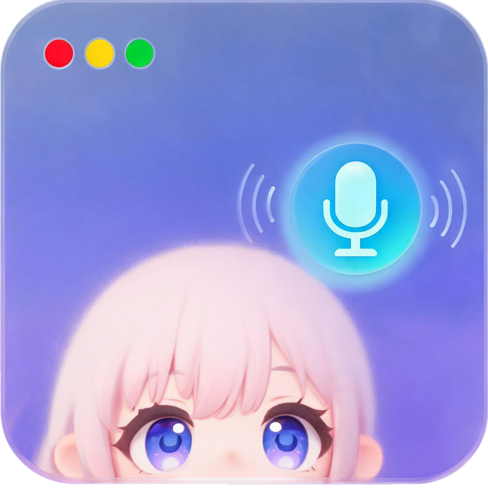

<p align="center">
  
</p>

<h1 align="center">DesktopAssistant</h1>

<p align="center">
  <strong>AI Agent 桌面伴侣 — Live2D 角色 + 语音审批 + 智能陪伴</strong>
</p>

<p align="center">
  
  
  
  
  
</p>

---

## What is this?

写代码时，Claude Code / Codex / Gemini 这些 AI Agent 经常在等你审批——你离开键盘、切了个窗口，审批就被阻塞了。

**DesktopAssistant** 是一个桌面 Live2D 角色，帮你解决这个问题：

- **监控 Agent 审批**，语音提醒你「Claude 在等你审批 Bash 操作」
- **按住说话**（Alt+Space），说「同意」帮你批准，说「不行」帮你拒绝
- **高危操作拦截**（`rm -rf`、`sudo` 等 14 种模式），强制终端确认
- 没有审批时就是你的**聊天伴侣**——角色有性格、有记忆、有情绪表演

## Features

| 功能 | 描述 |
|---|---|
| **Agent 审批监控** | Claude Code Hook 直连 + Codex notify 桥接 + 任意 CLI Agent PTY 包装 |
| **语音审批闭环** | Alt+Space → whisper 本地识别 → 安全门判定 → 自动注入按键 |
| **高危黑名单** | `rm -rf` / `sudo` / `git push --force` 等 14 种模式，100% 拦截率 |
| **Live2D 角色** | 透明置顶窗口，拖拽移动，缩放，点击互动，口型同步 |
| **情绪驱动表演** | LLM 回复 → 情绪解析 → 表情参数动画 + TTS 语调偏移 |
| **角色记忆** | 用户偏好自动提取，关系亲密度，对话摘要压缩，跨会话持久化 |
| **多引擎 TTS** | Edge TTS（默认） / GPT-SoVITS / CosyVoice3 MLX（插件） |
| **首启引导** | 6 步引导完成所有配置，零门槛上手 |

## 内置角色

| 角色 | 性别 | 性格 |
|---|---|---|
| **小猫 Mao** | 女 | 活泼好动、猫系、时而黏人时而高冷 |
| **Hiyori** | 女 | 温柔安静、细心体贴、偶尔害羞 |
| **White 赛博猫耳** | 女 | 傲娇猫系、表面高冷实则关心人 |
| **绅士 Suit** | 男 | 沉稳可靠、专业严谨、偶尔展现幽默 |
| **邻家少年** | 男 | 随和温暖、乐于助人、邻家大哥 |
| **清风少年** | 男 | 安静内敛、温文尔雅、观察力强 |

角色性格由 `character.manifest.yaml` 的 `persona` 段定义——换个 manifest 就换个灵魂，引擎代码零性格文本。

## Quick Start

### 前置条件

- macOS（Apple Silicon / Intel）/ Windows / Linux
- [Node.js](https://nodejs.org/) 20+ & [pnpm](https://pnpm.io/)
- [Rust](https://rustup.rs/) stable
- [whisper-cpp](https://github.com/ggerganov/whisper.cpp)：`brew install whisper-cpp`

### 安装

```bash
git clone git@github.com:HappySnappingTurtle/DesktopAssistant.git
cd DesktopAssistant/app
pnpm install

# 下载 whisper 模型（57MB）
mkdir -p ~/.desktop-assistant/models
curl -L -o ~/.desktop-assistant/models/ggml-base-q5_1.bin \
  https://huggingface.co/ggerganov/whisper.cpp/resolve/main/ggml-base-q5_1.bin
```

### 运行

```bash
pnpm tauri dev       # 开发模式（热更新）
pnpm tauri build     # 打包 → .dmg / .msi
```

### 首次启动

1. 引导页完成基本设置（称呼、LLM 配置）
2. 角色出现在桌面 → 右键打开菜单
3. 推荐本地 [Ollama](https://ollama.com) + qwen3:8b（免费无需 API Key）
4. 按住 **Alt+Space** 开始语音交互

## 操作说明

| 操作 | 效果 |
|---|---|
| 左键点击角色 | 互动（台词 + 动作 + 表情） |
| 左键按住拖动 | 移动角色位置 |
| 右键 | 菜单（设置 / 缩放 / 静音 / 退出） |
| 捏合 / Cmd+滚轮 | 缩放角色大小 |
| **Alt+Space 按住** | 语音输入（松开自动识别） |

## Agent 监控接入

**Claude Code**（自动 Hook）：设置面板 → Agent 监控 → 填项目路径 → 安装 Claude Hook

**Codex**（自动配置）：安装时自动配置 `~/.codex/config.toml`

**其他 CLI Agent**（PTY 包装器）：
```bash
cd app/src-tauri && cargo build --release --bin assist
./target/release/assist run -- gemini
./target/release/assist run --agent aider -- aider
```

## TTS 语音合成

| 引擎 | 类型 | 延迟 | 适用场景 |
|---|---|---|---|
| **Edge TTS** | 在线（默认） | 200-400ms | 日常使用，零配置 |
| **GPT-SoVITS** | 本地（需 GPU） | 取决于硬件 | 声线克隆，需手动启动服务 |
| **CosyVoice3 MLX** | 本地插件 | ~7-9s (M2) | Apple Silicon，设置中一键安装 |

CosyVoice3 在设置中提供**傻瓜版**（一键安装+启动）和**高级版**（自定义参数），安装前自动检测硬件兼容性。

## Architecture

```
┌──────────────────────────────────────────────────┐
│             Tauri Main Process (Rust)              │
│  Event Bus · Claude Hook · PTY · TTS (3 engines)  │
│  Config (Keychain) · LLM Provider · Voice (cpal)  │
│  CosyVoice3 Plugin Manager                        │
└───────────────────┬──────────────────────────────┘
                    │ Tauri IPC
┌───────────────────┴──────────────────────────────┐
│             WebView (TypeScript)                   │
│  Live2D Renderer · Behavior Engine · TTS Queue    │
│  Emotion System · Memory · Conversation Manager   │
│  Settings (Simple/Advanced) · Onboarding          │
└──────────────────────────────────────────────────┘
```

## 自定义角色

创建 `app/public/characters/<id>/` 目录，放入 Live2D 模型和 manifest：

```yaml
# character.manifest.yaml
schema_version: 1
id: my-character
display_name: "我的角色"
model_entry: model/xxx.model3.json
gender_presentation: female

persona:
  personality: "活泼开朗、喜欢聊天"
  speech_style: "语气轻快，偶尔用颜文字"
  greeting: "你好呀！今天要做什么？"

voice:
  provider: edge-tts
  voice: zh-CN-XiaoyiNeural
  pitch: "+2Hz"
  rate: "+3%"

motion_map:
  idle: Idle
  greet: TapMotion
  cheer: HappyMotion

expression_map:
  happy: exp_happy
  sad: exp_sad
```

## 声线训练（可选）

`voice-training/` 目录提供 GPT-SoVITS 声线训练流水线：

```bash
cd voice-training
./scripts/01_setup_env.sh      # 安装环境
./scripts/02_prepare_data.sh   # 准备数据
./scripts/03_train_all.sh      # 训练 6 角色
./scripts/04_start_server.sh   # 启动推理服务
./scripts/05_verify.sh         # 验证效果
```

## Tech Stack

| 层 | 技术 |
|---|---|
| 桌面壳 | Tauri 2 (Rust + WebView) |
| 前端 | TypeScript + PixiJS 7 + pixi-live2d-display (lipsyncpatch) |
| 语音识别 | whisper.cpp（本地，base-q5_1） |
| 语音合成 | Edge TTS / GPT-SoVITS / CosyVoice3 MLX |
| LLM | Anthropic / OpenAI 兼容 / Ollama |
| 存储 | JSON config + macOS Keychain / Windows DPAPI |
| 插件 | CosyVoice3 managed lifecycle（venv + model auto-download） |

## Tests

```bash
cd app
pnpm test                        # 前端 186 vitest
cd src-tauri
cargo test --lib                 # Rust 62 tests
                                 # 总计 248 tests
```

## Roadmap

- [ ] 多会话看板（同时监控多个 Agent）
- [ ] 唤醒词持续监听
- [ ] 屏幕视觉陪玩（截屏 + 视觉 LLM）
- [ ] 模型社区导入（zip 拖入）
- [ ] CosyVoice3 / Qwen3-TTS 实时推理优化

## License

MIT

## Credits

- [Tauri](https://tauri.app/) — 桌面框架
- [Live2D Cubism SDK](https://www.live2d.com/) — 模型渲染
- [pixi-live2d-display](https://github.com/guansss/pixi-live2d-display) — PixiJS Live2D 集成
- [whisper.cpp](https://github.com/ggerganov/whisper.cpp) — 本地语音识别
- [Edge TTS](https://github.com/nickerqin/msedge-tts) — 微软语音合成
- [GPT-SoVITS](https://github.com/RVC-Boss/GPT-SoVITS) — 声线克隆
- [mlx-audio](https://github.com/Blaizzy/mlx-audio) — Apple Silicon TTS
- 角色模型来自 [BOOTH](https://booth.pm/) 免费原创作品
